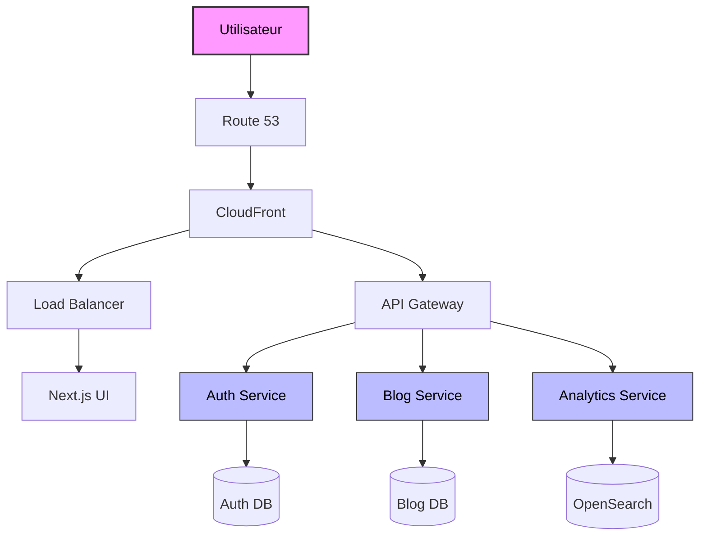
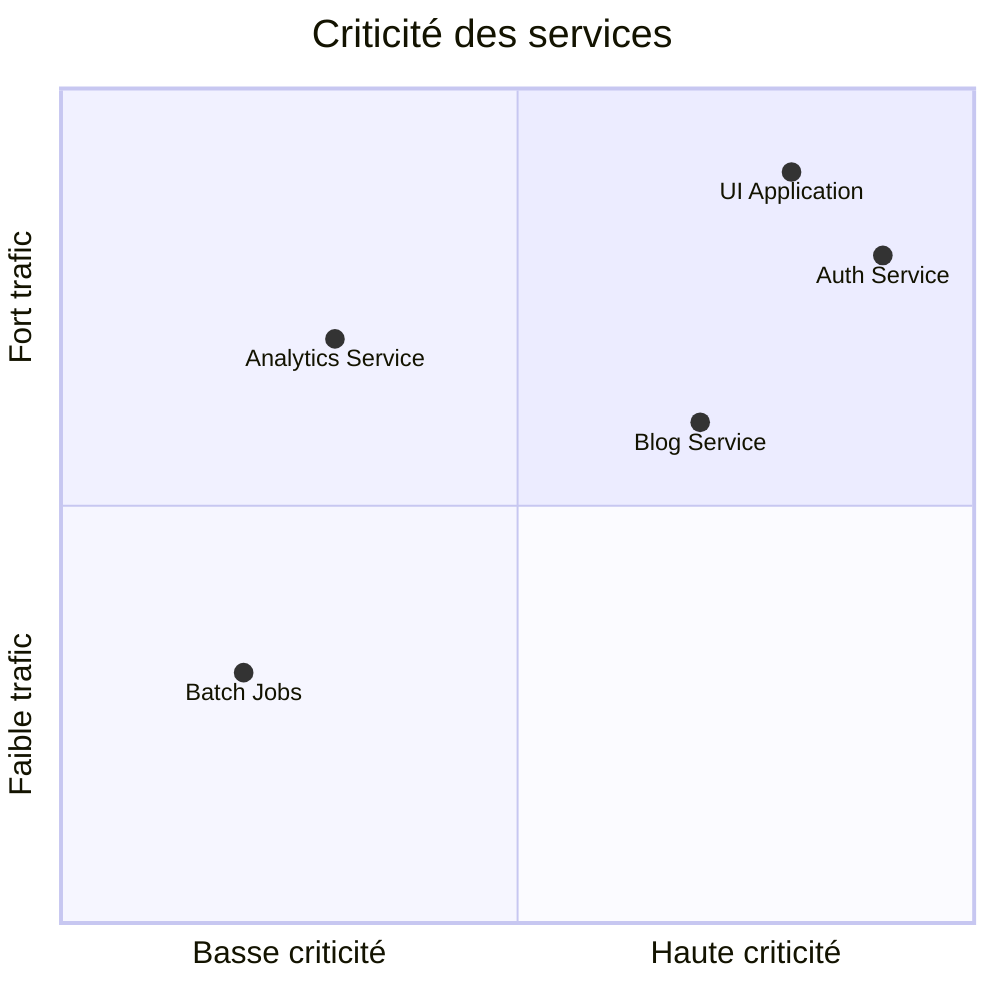
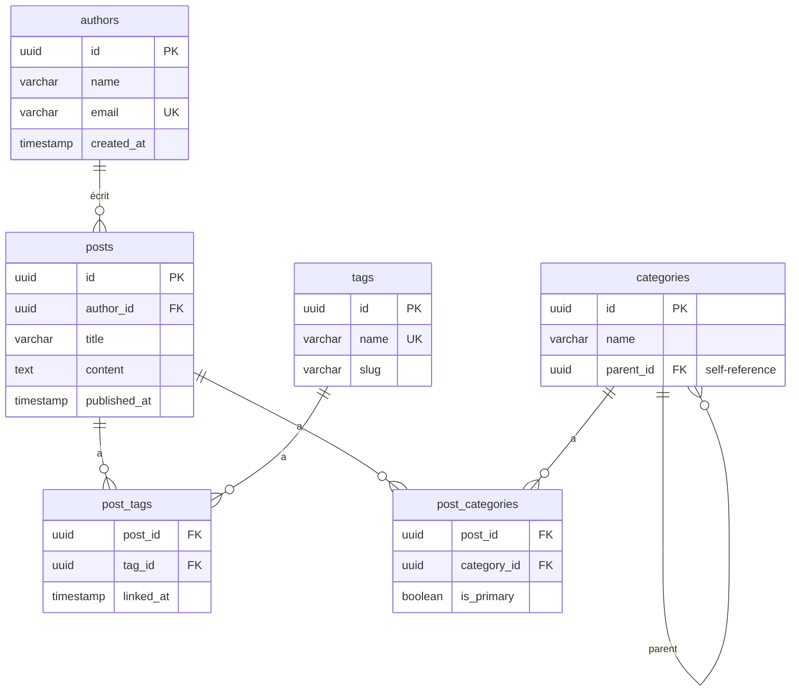
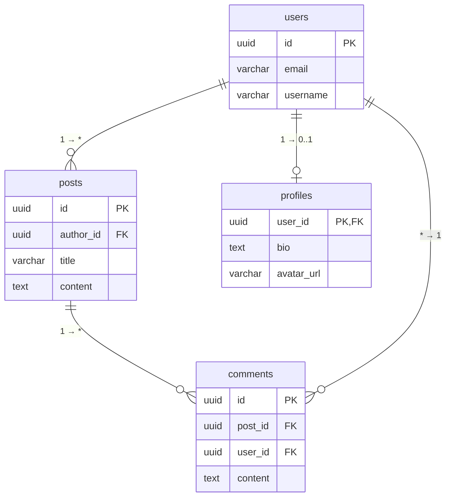
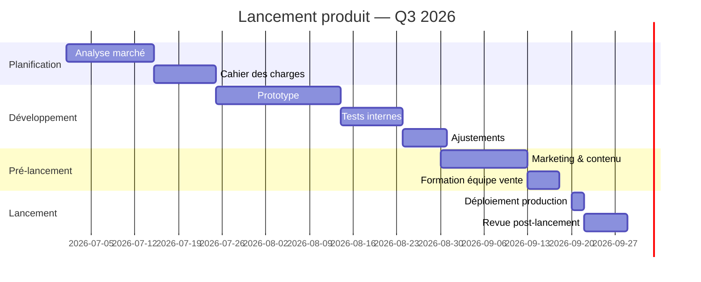

# test-github-actions
test github actions

# test docker build
```bash
docker build -t amveremes/test-github-actions .
```

# create release with goreleaser

Example :
```bash
git tag v0.1.22
git push origin v0.1.22
```

Start container :
```bash
docker run -d -p 5000:5000 ghcr.io/amveremes/test-github-actions:latest
```

# Architecture de l'infrastructure AWS

## Vue d'ensemble

Voici l'architecture de notre infrastructure gérée par Terraform/Terramate :

```mermaid
architecture-beta
    group dns(logos:aws-route53)[DNS Zone]
    group delivery(logos:aws-cloudfront)[Content Delivery]
    group compute(logos:aws-ec2)[Compute Layer]
    
    service route53(logos:aws-route53)[Route 53] in dns
    service cloudfront(logos:aws-cloudfront)[CloudFront] in delivery
    service alb(logos:aws-ec2)[Load Balancer] in compute
    service ui(logos:nextjs)[UI Application] in compute
    
    route53:R --> L:cloudfront
    cloudfront:R --> L:alb
    alb:B --> T:ui
```

```mermaid
architecture-beta
    group api(logos:aws-api-gateway)[API Layer]
    group backend(logos:aws-lambda)[Backend Services]
    group data(logos:aws-dynamodb)[Data Layer]
    
    service gateway(logos:aws-api-gateway)[API Gateway] in api
    service auth(logos:aws-lambda)[Auth Service] in backend
    service blog(logos:aws-lambda)[Blog Service] in backend
    service analytics(logos:aws-lambda)[Analytics Service] in backend
    service auth_db(logos:aws-dynamodb)[Auth DB] in data
    service blog_db(logos:aws-dynamodb)[Blog DB] in data
    service search(logos:aws-open-search)[OpenSearch] in data
    
    gateway:R --> L:auth
    gateway:R --> L:blog
    gateway:R --> L:analytics
    
    auth:R --> L:auth_db
    blog:R --> L:blog_db
    analytics:R --> L:search
```














